# Streaming 102: The world beyond batch

[Streaming102：The world beyond batch– O'Reilly](https://www.oreilly.com/radar/the-world-beyond-batch-streaming-102/)

编者注：这是由两部分组成的系列文章中的第二篇，涉及数据处理的发展，重点关注流系统，无限制的数据集和大数据的未来。[看到第一部分](https://www.oreilly.com/ideas/the-world-beyond-batch-streaming-101)。另外，[请查看](https://www.safaribooksonline.com/library/view/streaming-systems/9781491983867/) Tyler Akidau ，Slava Chernyak和Reuven Lax撰写的[“ Streaming Systems”](https://www.safaribooksonline.com/library/view/streaming-systems/9781491983867/)。

[请访问](https://learning.oreilly.com/resource-centers/) O'Reilly在线学习[资源中心](https://learning.oreilly.com/resource-centers/)，以获取更多扩展技能的方法。

## **1 介绍**

欢迎回来！如果您错过了我以前的文章[《超越批处理的世界：Streaming 101》](https://www.oreilly.com/ideas/the-world-beyond-batch-streaming-101)，我强烈建议您花时间先读一遍。它为我将在这里中介绍的主题认为了必要的基础，并且假设您已经熟悉其中介绍的术语和概念。告诫讲师和所有这些。另外，请注意，这篇文章包含许多动画，因此尝试打印它的那些人将在某些最佳部分上丢失。警告打印机和所有这些。简要回顾一下，我上次围绕着三个主要领域：**术语**，精确定义了我使用“流”之类的重载术语时的含义；**批处理与流式处理**，比较两种类型的系统的理论功能，并假设使流式处理系统超过批处理对等系统仅需要两件事：正确性和时间推理工具；和**数据处理模式**，研究批处理和流处理系统在处理有界和无界数据时所采用的基本方法。

在这篇文章中，我想进一步关注上次的数据处理模式，但要更详细些，并在具体示例的背景下进行。

- **Streaming 101 Redux：**简要回顾了Streaming 101中约会的概念，并添加了一个正在运行的示例以突出说明要点。
- **Streaming 102****：流**式传输101的配套内容，详细介绍了在处理无边界数据时很重要的其他概念，并继续使用具体示例说明它们的工具。

到完成时，我们将涵盖我认为是健壮的乱序数据处理所需的核心原则和概念集；这些是进行时间推理的工具，可让您真正超越传统的批处理。为了让您了解它们的实际效果，我将使用[Dataflow SDK](https://github.com/GoogleCloudPlatform/DataflowJavaSDK)代码片段（即[Google Cloud Dataflow](https://cloud.google.com/dataflow/)的API）以及动画来提供概念的直观表示。我之所以使用Dataflow SDK而不是使人们可能不熟悉的某些东西（例如火花流或风暴）的原因是，在这一点上，实际上没有其他系统可以提供我想要覆盖的所有示例所必需的表达能力。好消息是其他项目也开始朝这个方向发展。更好的消息是我们（Google）今天[提交了](http://googlecloudplatform.blogspot.com/2016/01/Dataflow-and-open-source-proposal-to-join-the-Apache-Incubator.html)一份公告并加入Apache软件基金会，以创建一个Apache Dataflow孵化器项目（与工匠，Cloudera，Talend和其他一些公司合作），以期围绕健壮的乱序处理语义构造一个开放的社区和生态系统。由[数据流模型提供](http://www.vldb.org/pvldb/vol8/p1792-Akidau.pdf)。这将使2016年非常有趣。但是我离题了。

我低估了[[1\]](https://www.oreilly.com/radar/the-world-beyond-batch-streaming-102/#_ftn1)我想在介绍文章中打包很多内容，并且需要花费多长时间。在这一点上，我只是看不到延迟和扩展内容以适应该部分。如果有什么安慰的话，我最终在Strata + Hadoop World Singapore 2015上一个一个题为[“大规模数据处理的替代”](http://conferences.oreilly.com/strata/big-data-conference-sg-2015/public/schedule/detail/44947)的演讲（并[在6月的Strata + Hadoop World London） 2016年进行更新](http://conferences.oreilly.com/strata/hadoop-big-data-eu?intcmp=il-data-confreg-lp-stuk16_20160119_radar_tyler_akidau_streaming_102_post_strata_london_link)）。在比较部分中介绍了我想介绍的许多材料；幻灯片非常漂亮，[可以在这里找到](http://goo.gl/5k0xaL)为了您的阅读乐趣。可以肯定，这不太一样，而是是事实。现在，开始流式传输！

## **2 回顾与路线图**

在Streaming 101中，我首先减少了一些术语。我首先区分**有界数据和无界数据**。有界数据源的大小是有限的，通常被称为“批处理”数据。无限制的源可能具有无限的大小，通常被称为“流”数据。我尽量避免使用批处理和流式处理来指代数据源，因为这些名称带有某些误导且经常受到限制的含义。然后，我继续定义批处理引擎**和流引擎之间**的**区别：**批处理引擎是设计时仅考虑有限数据的，而流引擎设计时则考虑了无限制的数据。我的目标是在引用执行引擎时仅使用术语批处理和流传输。

在用术语讲完之后，我介绍了与处理无限制数据有关的两个重要的基本概念。我首先确定了**事件时间**（事件发生的时间）**和处理时间**（**处理过程**中观察到的时间）**之间**的**关键区别**。 。分析本身遇到的问题。然后，我介绍了**窗口化**的概念（即，沿时间边界划分数据集），这是应对无边界数据源在技术上永远不会结束这一事实的常用方法。是固定窗口和滑动窗口，但是窗口化的类型更加复杂，例如会话（其中，窗口由数据本身的特征定义，例如，捕获每个用户的活动会话，然后是不活动的间隔））的也也很广泛。除了这两个概念，我们现在将进一步研究另外三个：

- **水印（****Watermarks****）：**水印是关于事件时间的输入完整性的概念。 时间值为X的水印说明：“已观察到事件时间小于X的所有输入数据。” 这样，当观察无穷尽的数据源且无已知结局时，水印可作为进度的度量标准。
- **触发器（****Triggers****）** 触发器是一种机制，用于声明何时应相对于某些外部信号实现窗口的输出。 触发器提供了选择何时发出输出的灵活性。 它们还使得可以观察到窗口不断变化的输出。 这继而打开了随着时间推移精炼结果的大门，这允许在数据到达时提供推测性结果，并处理上游数据（修订版）随时间推移或相对于水印而言迟到的数据的变化（例如，移动场景） ，其中某人离线时某人的电话会记录各种操作及其事件时间，然后继续上传这些事件以在恢复连接后进行处理）。
- **累加（****Accumulation****）：** 累积模式指定针对同一窗口观察到的多个结果之间的关系。 这些结果可能会完全脱节，即代表一段时间内的独立增量，或者它们之间可能存在重叠。 不同的累积模式具有不同的语义和与之相关的成本，因此可以在各种用例中找到适用性。

最后，因为我认为这样可以更轻松地理解所有这些概念之间的关系，所以我们将在回答四个问题的结构内重新探究旧的问题，并探索新的问题，我提出的所有问题对于每个无限制的数据处理问题都是至关重要的 ：

- **计算出****什么****结果？****（****What****results are calculated?** **）**管道中的*转换*类型可以回答这个问题。这包括诸如计算总和，构建直方图，训练机器学习模型等之类的东西。从本质上讲，这也是经典批处理所回答的问题。
- **在****哪里****计算****结果****？****（****Where** **in event time are results calculated?** **）**通过在管道中使用*事件时间窗口*可以回答此问题。这包括来自Streaming 101的窗口化的常见示例（固定，滑动和会话），用例似乎没有窗口化的用例（例如，如Streaming 101中所述的与时间无关的处理；经典批处理通常也属于这种情况）类别），以及其他更复杂的窗口类型，例如限时拍卖。还应注意，如果在记录到达系统时将入口时间分配为事件的事件时间，则它也可以包括处理时间窗口。
- **在****何时****计算结果****？****（****When** **in processing time are results materialized?****）**通过使用水印和触发器可以回答此问题。这个主题有无限的变化，但是最常见的模式是在给定窗口的输入完成时使用水印来描绘，并使用触发器来指定早期结果（用于在窗口完成之前发出的推测性，部分结果）和后期结果（水印对于仅的英文完整性的*估计*，并且在水印声称给定窗口的输入完成之后，可能会收到更多输入数据）。
- **如何****细化结果****关联？（****How** **do refinements of results relate?** **）**这个问题可以通过使用的*累加*类型来回答：替换（结果都是独立且不同的），累加（以后的结果建立在先前结果的基础上）或累加和替换（对于先前触发的累加值加上收回的值）值）。

我们将在文章的其余部分中更详细地研究每个问题。 是的，我将把这种配色方案付诸实践，以期弄清楚在“**What****/****Where****/****When****/****How** ” [[2\]中](https://www.oreilly.com/radar/the-world-beyond-batch-streaming-102/#_ftn2)哪些概念与哪个问题有关。

## **3 Streaming 101 回顾**

首先，让我们回顾一下Streaming 101中介绍的一些概念，但是这次结合一些详细的示例，这些示例将有助于使这些概念更加具体。

### ***What* : transformations**

经典批处理中应用的转换回答了以下问题：“ **计算出****什么****结果？** ”尽管你们中的许多人可能已经熟悉经典的批处理，但是无论如何我们还是要从那里开始，因为它是基础，我们将添加所有其他概念。

在本节中，我们将看一个例子：在由10个值组成的简单数据集上计算带键整体和。如果您想更实用一点，可以将其视为通过将自己的独立绽放组合在一起来您可以想象它可以很好地放置在上面并使用情况监视用例。对于每个示例，我都会包含一小段数据流Java SDK伪代码，以使管道的定义更具体。从某种意义上说，这是伪代码，有时我会弯折规则以使示例更清楚，省略细节（例如使用具体的I / O源）或简化名称（ Java 中的当前触发器名称非常冗长）;为了清楚起见，我将使用更简单的名称）除了诸如此类的小事（在我[后记中](https://www.oreilly.com/radar/the-world-beyond-batch-streaming-102/#PS)明确列举了随后，我将提供指向实际代码演练的链接，以供那些对可以自己编译和运行的类似示范的人的使用。

如果您至少熟悉 Spark Streaming 或 Flink 之类的内容，则应该相对轻松地思考一下Dataflow代码在做什么。为了给您提供一个速成课程，Dataflow 中有两个基本原语：

- **PCollections**，代表数据集（可能是庞大的数据集），可以在这些数据集上执行并行转换（因此，名称的开头为“ P”）。
- **PTransforms**， PCollections 用于创建新的 PCollections。 PTransforms 可以执行逐元素的转换，可以将多个元素聚合在一起，也可以是其他元素的组合 PTransforms 。

图1. **转换类型。**图片提供：Frances Perry，经允许使用。

如果您发现自己感到困惑，或者只是想参考一下，可以看看[Dataflow Java SDK文档](https://cloud.google.com/dataflow/model/programming-model)。

就我们的范例而言，我们假设我们以 PCollection<KV<String, Integer>>命名的“输入”开始（即 PCollection 由字符串和孪生的键/值对组成，其中串联称为团队名称，而整体则是由来自相应团队中的任何个人）。在实际的管道中，我们将通过PCollection从I / O源读取原始数据（例如日志记录）来获取输入，然后Collection<KV<String, Integer>>通过将日志记录解析为适当的键/值对将其转换为。起见，在第一个示例中，我将为所有这些步骤包括伪代码，但在随后的示例中，我省略了I / O和解析部分。

因此，对于仅从I / O源中读取数据，解析团队/引发对并计算每个团队的分数总和的管道，我们会有类似的内容（请注意，您可以水平滚动代码段如果您的浏览器不够大，无法完全显示出来（例如在移动设备上）：

PCollection<String> raw = IO.read(...);

PCollection<KV<String, Integer>> input = raw.apply(ParDo.of(new ParseFn());

PCollection<KV<String, Integer>> scores = input

   .apply(Sum.integersPerKey());

Listing 1. **Summation pipeline**. Key/value data are read from an I/O source, with String (e.g., team name) as the key and Integer (e.g., individual team member scores) as the values. The values for each key are then summed together to generate per-key sums (e.g., total team score) in the output collection.

对于接下来的所有示例，在看到描述我们将要分析的管道的代码片段之后，我们将查看在具体数据集上执行该管道的动画效果。更简便，我们将看到对单个键对10一个输入数据执行管道的情况。在真实的管道中，您可以想象类似的操作将在多台计算机上并行发生，但是就我们的示例而言，使事情变得简单起来会更加清楚。

每个动画在两个维度上绘制输入和输出：事件时间（在X轴上）和处理时间（在Y轴上）。 因此，由管道观察到的实时从下到上进行，如粗白线所示。 输入是圆圈，圆圈内的数字表示该特定记录的值。 当管道观察到它们时，它们开始为灰色并改变颜色。

当管道观察值时，它会在其状态下累积值，并最终将汇总结果具体化为输出。 状态和输出由矩形表示，其总值位于顶部附近，矩形所覆盖的区域表示事件时间和累积到结果中的处理时间的部分。 对于清单1中的管道，当在经典批处理引擎上执行时，它将看起来像这样（注意，您需要单击/点击下面的图片以启动动画，然后动画将永远循环直到再次单击/点击。 ）：

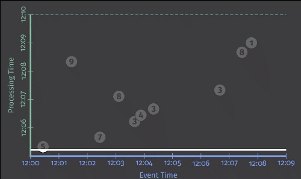

图2. **[经典批处理](https://fast.wistia.net/embed/iframe/24noytvllc?dnt=1#?secret=Nt9sguoWoI)。**图片提供：Tyler Akidau。

由于这是批处理管道，因此逐渐累积状态，直到看到所有输入（由顶部的绿色虚线表示）为止，此时将产生其相应的输出51。在此示例中，我们计算的是由于我们没有应用任何特定的窗口转换，因此将所有事件的时间相加；因此，用于状态和输出的矩形覆盖了整个X轴。但是，如果我们要处理无限制的数据源，那么经典的批处理是不够的。我们等不及输入结束，因为它实际上永远不会结束。我们想要的概念之一是窗口化，这是我们在Streaming 101中引进的。因此，在第二个问题的一部分中：**结果在****哪里****计算？** ”，我们现在简要回顾一下窗口。

### ***Where* : windowing** 

如上次讨论的那样，加窗是连续时间边界分割数据源的过程。常见的窗口策略包括固定窗口，滑动窗口和会话窗口：

图3. **示例窗口策略**。为每个示例显示了三个不同的键，突出显示了对齐的窗口（适用于所有数据）和未对齐的窗口（适用于数据的子集）之间的差异。图片来源： Tyler Akidau，灵感来自Robert Bradshaw的插图。

为了更好地了解实际情况下的窗口化，让我们采用整体求和和管道连接其窗口化为固定的两分钟窗口。使用Dataflow SDK，进行的更改是对转换的简单添加 Window.into（以蓝色文本突出显示）：

PCollection<KV<String, Integer>> scores = input

   .apply(Window.into(FixedWindows.of(Duration.standardMinutes(2))))

   .apply(Sum.integersPerKey());

清单2. 窗口求和代码。

回想一下，Dataflow提供了一个在批处理和流处理中都可以使用的统一模型，因为语义上的批处理实际上只是流的一个子集。这样，我们首先在批处理引擎上执行此管道；机制更加简单明了，当我们切换到流式引擎时，逐步为我们提供直接比较的功能。

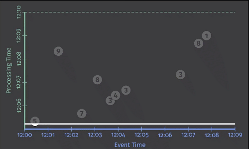

图4. [批处理引擎上的窗口求和](https://fast.wistia.net/embed/iframe/v12dlvvgfh?dnt=1#?secret=OBobCUaDpw)。图提供：Tyler Akidau。

和以前一样，输入会累积状态直到完全消耗掉，然后再产生输出。 但是，在这种情况下，我们得到四个输出，而不是一个输出：四个相关的两分钟事件时间窗口中的每个输出都有一个输出。

至此，我们重新审视了Streaming 101中引入的两个主要概念：事件时域与处理时域之间的关系以及窗口化。 如果想进一步，我们需要开始添加本节开头提到的新概念：水印，触发器和累积。 因此开始流式传输102。

## **4 Streaming102**

我们只是观察到批处理引擎上窗口化管道的执行。但是理想情况下，我们希望降低结果延迟，并且还希望原生处理无限制的数据源。切换到流引擎是朝着正确方向迈出的一步，但是批处理引擎有一个已知的点，每个窗口的输入已完成（即，一旦有限输入源中的所有数据都被消耗掉了），我们当前缺乏确定无限数据源替代的实用方法。输入水印。

### ***When* : watermarks**

水印是该问题的上半部分：“**在****何时****计算结果****？**”水印是事件时域中输入指向的时间概念。换句话说，它们是系统相对于事件流中处理的记录的事件时间（有界或无界，尽管其用途在无界情况下更为明显）预期进度和逐步的方式。

回想一下Streaming 101中的此图，这里做了一些修改，在这里我将事件时间和处理时间之间的偏差描述为大多数现实世界中分布式数据处理系统的时间的不断变化的函数。

图5. **事件时间进度，时滞和水印。**图片提供：Tyler Akidau。

我定义代表真实的那条蜿蜒的红线本质上是水印。转换处理时间的位移，它捕获事件时间长度的进度。从概念上讲，您可以将水印视为函数F（P）-> E，该函数在处理时间上花费一点，而在事件时间上返回一点。（更准确地说，该函数的输入实际上是正在观察水印的管线中点上游所有内容的当前状态：输入源，缓冲数据，正在处理的数据等；但是从概念上讲，它更简单（将其视为从处理时间到事件时间的映射。）事件时间的那个点E是系统认为事件时间小于E的所有输入都可以观察到的点。换一种说法，有人断言不会再看到事件时间小于E的更多数据。根据水印的类型（完美或启发式），断言可能分别是严格的保证或有根据的猜测：

- **完美的水印（****Perfect watermarks****）：**在我们对所有输入数据都拥有完备的知识的情况下，可以构造出完美的水印；在这种情况下，就没有迟到的数据；所有数据都是提早或准时的。
- **启发式水印（****Heuristic watermarks****）：**对于许多**分布式**输入源，完全了解输入数据是不切实际的，在这种情况下，下一个最佳选择是提供启发式水印。 启发式水印使用有关输入的任何可用信息（分区，分区内的排序（如果有），文件的增长率等）来提供尽可能准确的进度估计。 在许多情况下，此类水印的预测可以非常准确。 即使这样，使用启发式水印也意味着有时可能是错误的，这将导致数据过时。 我们将在下面的触发器部分中介绍如何处理最新数据。

水印是一个引人入胜且复杂的话题，要谈论的话题远远超出我在这里或边缘所能理解的范围，因此，对水印的进一步深入研究将不得不等待以后的发布。 现在，为了更好地了解水印的作用以及它们的一些缺点，让我们看两个仅使用水印来确定何时执行[清单2](https://www.oreilly.com/radar/the-world-beyond-batch-streaming-102/#L2)的窗口化管道时实现输出的流引擎的示例。 左边的示例使用了完美的水印； 右边的使用启发式水印。

图6. **[具有完美（左）和启发式（右）水印的流引擎上的窗口求和](https://fast.wistia.net/embed/iframe/zbl7xyy294?dnt=1#?secret=0jpfVxCVN1)。**图片提供：Tyler Akidau。

在这两种情况下，当水印通过窗口的末端时，窗口都会变为实物。 两次执行之间的主要区别在于，右侧水印计算中使用的启发式算法未考虑9的值，从而极大地改变了水印的形状[[3\]](https://www.oreilly.com/radar/the-world-beyond-batch-streaming-102/#_ftn3)。这些示例突出了水印的两个缺点（以及其他任何完整性的概念），特别是它们可以是：

- **太慢（****Too slow****）**：当任何类型的水印由于已知的未处理数据而被延迟时（例如，由于网络带宽限制而导致输入日志缓慢增长），如果水印的进展是您唯一依赖的因素，则直接转化为输出延迟刺激效果。这在左图中最明显，在最晚到达的9处，所有后续窗口都将保留水印，即使这些窗口的输入数据已较早完成。对于第二个窗口[12:02，12:04）尤其明显，从第二个窗口出现第一个值直到我们看到该窗口的任何结果，大约要花7分钟的时间。在此示例中，启发式水印不会遇到同样严重的问题（直到输出前五分钟），但这并不是说启发式水印不会遭受水印滞后；这实际上只是我在此特定示例中选择从启发式水印中省略的记录的结果。这里的重点是：虽然水印提供了非常有用的完整性概念，但取决于产生输出的完整性通常并不理想。延迟角度。想象一下一个仪表板，其中包含按小时或天显示的重要指标。您不太可能要等待一整小时或一天才能开始看到当前窗口的结果；这是使用经典批处理系统为此类系统提供动力的痛苦点之一。取而代之的是，随着输入的变化并最终变得完整，这些窗口的结果会随着时间的推移而细化会更好。
- **太快（Too fast）**：如果启发式水印的发布时间早于应有的错误，则事件发生时间早于水印的数据可能会在稍后的某个时间到达，从而产生较晚的数据。 这就是在右边的示例中发生的情况：在观察到该窗口的所有输入数据之前，水印超过了第一个窗口的末尾，从而导致输出值为5而不是14，这是不正确的。 启发式水印问题； 他们的试探性暗示他们有时会错。 因此，如果您关心正确性，仅依靠它们来确定何时实现输出是不够的。

在Streaming 101中，我做了一些相当强调的声明，即完整性的概念不足以对无边界数据流进行健壮的无序处理。 这两个缺点（水印太慢或太快）是这些论点的基础。 您根本无法从仅依赖完整性概念的系统中获得低延迟和正确性。 解决这些缺点是触发因素起作用的地方。

### ***When* : The wonderful thing about triggers, is triggers are wonderful things!**
**(when：关于触发器的奇妙之处在于，触发器是奇妙的事物！)** 

问题的答案的下半部分是触发因素：“**在****何时****计算结果**” 触发器声明窗口的输出应在处理时间内发生（尽管触发器本身可以根据其他时域中发生的事情（例如在事件时域中进行的水印）做出这些决定）。 窗口的每个特定输出都称为窗口的窗格。

用于触发的信号示例包括：

- **Watermark progress (i.e., event time progress) [****水印进度（即事件时间进度****]**，是我们在[图6中](https://www.oreilly.com/radar/the-world-beyond-batch-streaming-102/#FIG6)已经看到的隐式版本，其中，当水印通过窗户的末尾时，实现了输出[[4\]](https://www.oreilly.com/radar/the-world-beyond-batch-streaming-102/#_ftn4)。另一个用例是，当窗户的生存期超过某个有用的范围时，将触发垃圾回收，稍后将介绍一个示例。
- **Processing time progress [****处理时间进度****]**，这对于提供定期的定期更新很有用，因为处理时间（与事件时间不同）始终或多或少地均匀地进行且没有延迟。
- **Element counts [****元素计数****]**，对于在窗口中观察到一定数量的元素后触发触发很有用。
- **Punctuations [****标点符号****]** 或其他与数据相关的初始化，其中某些记录或记录特征（例如EOF元素或刷新事件）指示应生成输出。

除了基于特定信号触发的简单触发外，还有复合初始化可用于创建更复杂的触发逻辑。

- **Repetitions [****重复****]****，**与处理时间触发器结合使用时特别有用，可提供定期的定期更新。
- **Conjunctions (logical AND) [****连词（逻辑AND）****]**，仅在触发所有子触发器后才触发（例如，在水印通过窗口结尾并观察到终止的标点符号记录之后）。
- **Disjunctions (logical OR)[****析取值（逻辑或）****]**，会在任何孩子触发解雇后触发（例如，在水印通过窗口结尾之后，否则我们会观察到终止的标点符号记录）。
- **Sequences [****序列****]**，以预定义的顺序触发子触发器的进度。

为了使触发器的概念更加具体（并给我们一些基础），我们继续将清单6中的隐式默认触发器添加到[清单2](https://www.oreilly.com/radar/the-world-beyond-batch-streaming-102/#L2)的代码中，来明确显示[图6中](https://www.oreilly.com/radar/the-world-beyond-batch-streaming-102/#FIG6)使用的默认触发器：

PCollection<KV<String, Integer>> scores = input

   .apply(Window.into(FixedWindows.of(Duration.standardMinutes(2)))

​     .triggering(AtWatermark()))

  .apply(Sum.integersPerKey());

清单3.**显式默认触发器****。**

考虑到这一点，并且对必须提供哪些触发器有基本的了解，我们可以着眼于解决水印太慢或太快的问题。 在这两种情况下，我们本质上都希望在水印前进超过窗口末尾之前或之后为给定的窗口提供某种常规的物化更新（除了在水印阈值处收到的更新之外） 通过窗口的结尾）。 因此，我们需要某种重复触发。 问题就变成了：我们在重复什么？

在**太慢**的情况下（即提供早期的推测结果），我们可能应该假定任何给定窗口都可能有稳定数量的传入数据，因为我们知道（根据定义，处于窗口的早期） 到目前为止，我们观察到的窗口输入不完整。 这样，在处理时间提前时（例如，每分钟一次）定期触发可能是明智的选择，因为触发触发的次数将不取决于窗口实际观察到的数据量； 在最坏的情况下，我们只会定期触发触发信号

在**太快**的情况下（即，由于启发式水印而提供更新的结果以响应最新数据），我们假设我们的水印基于相对准确的启发式（通常是合理的安全假设）。 在这种情况下，我们不希望经常看到过时的数据，但是当我们这样做时，最好快速修改结果。 在观察到元素计数为1之后触发将使我们能够快速更新结果（即，只要我们看到较晚的数据，便会立即更新），但鉴于预期的较晚数据的频率不高，这不太可能使系统不堪重负。

请注意，这些只是示例：我们可以根据需要立即选择不同的触发器（或选择完全不为其中一个或两个触发）。

最后，我们需要精心安排这些各种触发因素的时间：提前，准时和延迟。 我们可以使用 Sequence 触发器和特殊的 OrFinally 触发器来执行此操作，该触发器将安装一个子触发器，该子触发器在子触发器触发时终止父触发器。

PCollection<KV<String, Integer>> scores = input

   .apply(Window.into(FixedWindows.of(Duration.standardMinutes(2)))

​     .triggering(Sequence(

​       Repeat(AtPeriod(Duration.standardMinutes(1)))

​         .OrFinally(AtWatermark()),

​       Repeat(AtCount(1))))

   .apply(Sum.integersPerKey());

清单4. **手动指定的早期和晚期点火。**

但是，这很罗唆。 并给出了repeated-early | on-time | repeated-late 触发很常见，我们在Dataflow中提供了一个自定义（但在语义上等效）的API，以使指定此类触发器更加简单明了：

PCollection<KV<String, Integer>> scores = input

   .apply(Window.into(FixedWindows.of(Duration.standardMinutes(2)))

​     .triggering(

​       AtWatermark()

​         .withEarlyFirings(AtPeriod(Duration.standardMinutes(1)))

​         .withLateFirings(AtCount(1))))

   .apply(Sum.integersPerKey());

清单5. **通过早期/晚期API进行早期和晚期触发。**

然后在流引擎上执行清单4或5（如前所述，具有完善的和启发式的水印），结果如下：

图7. **[具有早期触发和延迟触发的流引擎上的窗口求和](https://fast.wistia.net/embed/iframe/li3chq4k3t?dnt=1#?secret=PEeTklYw6k)。**图片提供：Tyler Akidau。

这个版本比[图6](https://www.oreilly.com/radar/the-world-beyond-batch-streaming-102/#FIG6)有两个明显的改进：

- 对于第二个窗口中的“ **水印太慢** ”的情况，[12：02，12：04）：现在，我们每分钟提供一次定期的早期更新。在完美的水印情况下，最明显的区别是首次输出时间从将近7分钟减少到了3分半。但在启发式情况下也也明显得到了改进。现在，这两个版本都可以随时间提供稳定的细化（值分别为7、14、22的窗格），在输入变得完整与窗口的最终输出窗格实现之间的等待时间相对偏移。
- 对于第一个窗口中的“ **启发式水印太快** ”的情况，[12：00，12：02）：当值9出现较晚时，我们立即将其合并到一个新的校正后的数值14的窗格中。

这些新主轴的一个有趣的替代是，它们可以有效地规范完美和启发式水印版本之间的输出模式。虽然[图6](https://www.oreilly.com/radar/the-world-beyond-batch-streaming-102/#FIG6)中的两个版本完全不同，但此处的两个版本看起来非常相似。

在完美的水印情况下，我们知道一旦水印通过了窗户的末端，我们将再也看不到窗户的任何数据，因此我们可以在那时删除窗户的所有状态。在启发式水印的情况下，我们仍然需要在重组内部保持窗口状态以解释较晚的数据。但是后来，我们的系统还没有任何好的方法来知道每个窗口需要保持多长期。那就是允许迟到的地方。

### ***When* :  allowed lateness (i.e., garbage collection)**
***When* : 允许拒绝（即垃圾收集）**

在继续讨论最后一个问题（**How** do refinements of results relate?”）之前，我想谈谈长期存在的无序流处理系统中的实际必要性：垃圾收集。 在[图7](https://www.oreilly.com/radar/the-world-beyond-batch-streaming-102/#FIG7)的启发式水印示例中，每个窗口的持久状态在示例的整个生命周期中徘徊； 这是必要的，以便我们能够/在它们到达时适当地处理较晚的数据。 但是，尽管能够一直保持所有持久状态直到时间结束是很棒的，但实际上，在处理无限制数据源时，为给定窗口保留状态（包括元数据）通常是不切实际的 无限期地 我们最终将用完磁盘空间。

结果，任何现实世界中无序的处理系统都需要提供某种方式来限制其处理的窗口的生命周期。 一种简洁明了的方法是在系统中允许的延迟内定义一个范围，即，对任何给定的记录（相对于水印）延迟多长时间来限制系统进行处理； 在此范围之后到达的所有数据都将被丢弃。 限定了各个数据的延迟时间之后，您还可以精确地确定窗口状态必须保持多长时间：直到水印超过窗口末尾的延迟范围[[5\]](https://www.oreilly.com/radar/the-world-beyond-batch-streaming-102/#_ftn5)为止。 但是，此外，您还赋予了系统自由，可在观察到数据后立即删除所有数据，这意味着该系统不会浪费资源来处理没人关心的数据。

由于允许的延迟与水印之间的相互作用有些微妙，因此值得一看。 让我们采用[清单5](https://www.oreilly.com/radar/the-world-beyond-batch-streaming-102/#L5) / [图7中](https://www.oreilly.com/radar/the-world-beyond-batch-streaming-102/#FIG7)的启发式水印管道，并添加一分钟的延迟地平线（请注意，严格选择此特定地平线是因为它很好地适合了该图；对于实际使用案例，可能会使用更大的地平线 更加实用）：

PCollection<KV<String, Integer>> scores = input

.apply(Window.into(FixedWindows.of(Duration.standardMinutes(2)))

   .triggering(

​     AtWatermark()

​     .withEarlyFirings(AtPeriod(Duration.standardMinutes(1)))

​     .withLateFirings(AtCount(1)))

  .withAllowedLateness(Duration.standardMinutes(1)))

.apply(Sum.integersPerKey());

清单6. **允许延迟的提前和连续射击**

该管道的执行类似于下面的图8，在其中添加了以下功能以突出显示允许延迟的影响：

- 现在，用勾号注释表示当前处理时间位置的粗白线，这些勾号指示所有活动窗口的延迟时间（事件时间）。
- 一旦水印通过了窗口的延迟地平线，该窗口就会关闭，这意味着该窗口的所有状态都将被丢弃。 我留下一个虚线矩形，显示关闭窗口时（在两个域中）所覆盖的时间范围，一条小尾巴向右延伸以表示该窗口的延迟水平（与水印进行对比）。
- 仅对于此图，我为第一个窗口添加了一个值为6的附加延迟数据。6 延迟了，但仍在允许的延迟范围内，因此将其合并到值为11的更新结果中。9 到达延迟范围之外，因此将其丢弃。

图8. **具有早期触发和延迟触发并允许延迟的流引擎上的窗口求和。**图片提供：Tyler Akidau。

关于延迟时间的最后两点注释：

- 绝对明确的，如果您碰巧巧正在使用可提供完美水印的来源的数据，则无需处理延迟数据，并且允许的连续时间范围为零秒将是最佳的。这就是我们在[图7](https://www.oreilly.com/radar/the-world-beyond-batch-streaming-102/#FIG7)的完美水印部分中看到的。
- 即使在使用启发式水印时，也需要指定延迟时间范围的规则的一个替代的例外是，例如始终计算有限数量的键的聚合（例如，计算对网站的访问总数）在所有时间内，均按网络浏览器系列分组）。在这种情况下，系统中活动窗口的数量受到使用中有限键空间的限制。只要键的数量保持在可控的低水平，就不必担心通过允许的延迟来限制窗户的寿命。

实用性已经足够，让我们继续第四个也是最后一个问题。

### ***How* : accumulation**

当使用触发器在一段时间内为单个窗口生成多个窗格时，我们发现自己面临最后一个问题：“**如何****细化结果****关联？（****How** **do refinements of results relate?** **）**” 到目前为止，在示例中，每个连续的窗格都基于紧接其前的窗格。 但是，实际上存在三种不同的累积模式[[6\]](https://www.oreilly.com/radar/the-world-beyond-batch-streaming-102/#_ftn6)：

- **Discarding [****丢弃****]****：**每次实现窗格时，任何存储状态都会被丢弃。 这意味着每个连续的窗格都独立于之前的窗格。 当下游使用者自己执行某种累加时，例如当将整数发送到希望接收增量的系统中时，丢弃模式将很有用，它将累加起来以产生最终计数。
- **Accumulating [****累积****]****：**如在[图7中](https://www.oreilly.com/radar/the-world-beyond-batch-streaming-102/#FIG7)每次实现窗格时，任何存储的状态都会保留，将来的输入会累积到现有状态中。 这意味着每个连续的窗格都建立在先前的窗格上。 当以后的结果可以简单地覆盖以前的结果时，例如在将输出存储在BigTable或HBase之类的键/值存储中时，累积模式很有用。

- **Accumulating & retracting [****累积和收缩****]****：**与累积模式一样，但是在生成新窗格时，也会为以前的窗格产生独立的收缩。 回缩（与新的累加结果相结合）本质上是一种明确的说法，“我之前告诉过您结果是X，但我错了。 摆脱我上次告诉您的X，然后将其替换为Y。” 在两种情况下，撤回特别有用：

- - 当下游的使用者按**不同的维度对数据**进行**重新分组**时，新值很可能最终以与先前值不同的键输入，从而最终以不同的组结束。 在这种情况下，新值不能只覆盖旧值； 相反，您需要撤消操作以从旧组中删除旧值，而新值将合并到新组中。
  - 当使用**动态窗口**（例如会话，我们将在下面更详细地介绍）时，由于窗口合并，新值可能会替换多个以前的窗口。 在这种情况下，可能难以仅从新窗口确定要替换哪些旧窗口。 对旧窗口进行显式缩回可以使任务简单明了。

并排观察时，每个组的不同语义更加清晰。 考虑[图7中](https://www.oreilly.com/radar/the-world-beyond-batch-streaming-102/#FIG7)第二个窗口的三个窗格（事件时间范围为[12:02，12:04]的一个）。 下表显示了在三种受支持的累积模式下，每个窗格的值是什么样的（“累积模式”是[图7中](https://www.oreilly.com/radar/the-world-beyond-batch-streaming-102/#FIG7)使用的特定模式）：

|                    | **Discarding** | **Accumulating** | **Accumulating & Retracting** |
| ------------------ | -------------- | ---------------- | ----------------------------- |
| **Pane 1: [7]**    | 7              | 7                | 7                             |
| **Pane 2: [3, 4]** | 7              | 14               | 14, -7                        |
| **Pane 3: [8]**    | 8              | 22               | 22, -14                       |
| 最后元素的值       | 8              | 22               | 22                            |
| 总和               | 22             | 51               | 22                            |

Table 1. **Comparing accumulation modes using the second window from Figure 7.**

- **Discarding** **[****丢弃****]：**每个窗格仅合并在该特定窗格期间到达的值。 因此，观察到的最终值不能完全捕获总和。 但是，如果要对所有独立窗格本身求和，将得出正确的答案22。这就是为什么当下游使用者自己在物化窗格上执行某种聚合时，丢弃模式很有用的原因。
- **Accumulating [****累积****]****：**：如[图7](https://www.oreilly.com/radar/the-world-beyond-batch-streaming-102/#FIG7)所示，每个窗格都包含在该特定窗格中到达的值，以及先前窗格中的所有值。 这样，观察到的最终值正确地捕获了22的总和。但是，如果要对各个窗格本身进行求和，则实际上将分别对窗格2和1的输入进行两次和三次计数，得出不正确的总和为 **51**。这就是为什么当您可以简单地用新值覆盖以前的值时，累加模式最有用的原因：新值已经合并了到目前为止看到的所有数据。
- **累积和撤回：**。每个窗格都包括新的累积模式值以及上一个窗格的值的撤回。 这样，观察到的最后一个值（非收缩）以及所有实例化窗格的总和（包括收缩）都为您提供了正确的答案22。这就是收缩如此强大的原因。

为了看到实际的丢弃模式，我们将对[清单5](https://www.oreilly.com/radar/the-world-beyond-batch-streaming-102/#L5)进行以下更改：

PCollection<KV<String, Integer>> scores = input

   .apply(Window.into(FixedWindows.of(Duration.standardMinutes(2)))

​       .triggering(

​         AtWatermark()

​           .withEarlyFirings(AtPeriod(Duration.standardMinutes(1)))

​           .withLateFirings(AtCount(1)))

​       .discardingFiredPanes())

   .apply(Sum.integersPerKey());

清单7. **放弃早期/晚期触发的模式版本。**

在具有启发式水印的流引擎上再次运行将产生如下输出：

 

图9. **在流引擎上最大化早期/晚期触发的模式版本。**图片提供：Tyler Akidau。

尽管输出的总体形状类似于[图7](https://www.oreilly.com/radar/the-world-beyond-batch-streaming-102/#FIG7)中的累积模式版本，但请注意，此丢弃版本中的窗格如何不重叠。 结果，每个输出彼此独立。

如果我们想看看撤消的实际效果，那么变化将是相似的（但是请注意，撤消目前仍在针对Google Cloud Dataflow进行开发，因此该API的命名有些是推测性的，尽管不太可能与我们最终发货的内容）：

PCollection<KV<String, Integer>> scores = input

   .apply(Window.into(FixedWindows.of(Duration.standardMinutes(2)))

​     .triggering(

​       AtWatermark()

​         .withEarlyFirings(AtPeriod(Duration.standardMinutes(1)))

​         .withLateFirings(AtCount(1)))

​     .accumulatingAndRetractingFiredPanes())

   .apply(Sum.integersPerKey());

清单8. **早/晚点火的累积和缩回模式版本。**

并在流引擎上运行，这将产生如下输出：

图10. **流引擎上早期/晚期点火的累积和收缩模式版本。**图片提供：Tyler Akidau。

由于每个窗口的窗格都重叠，因此要清楚地看到缩回有点棘手。缩进以红色表示，与重叠的蓝色窗格组合在一起会产生略带紫色的颜色。我还在给定窗格中水平移动了两个输出的值（并用逗号分隔了它们的值），以转换容易区分。

并排比较图[9](https://www.oreilly.com/radar/the-world-beyond-batch-streaming-102/#FIG9)，图[7](https://www.oreilly.com/radar/the-world-beyond-batch-streaming-102/#FIG7)（仅启发式）和图[10](https://www.oreilly.com/radar/the-world-beyond-batch-streaming-102/#FIG9)的最终帧，可以很好地对比这三种模式的视觉效果：

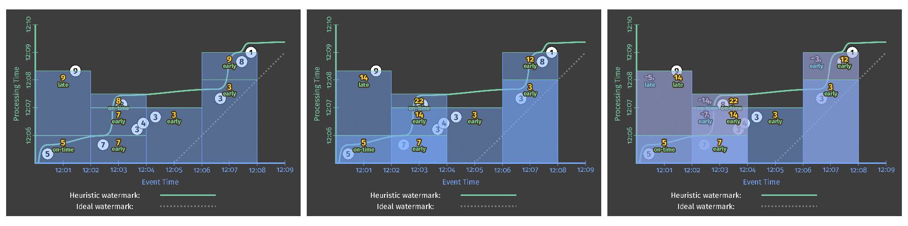

图11. **累积模式的并排比较：体积（左），累积（中）和累积与缩回（右）。**图片提供：Tyler Akidau。

可以想象，按顺序显示的模式（替换，累加，累加和替换）在存储和计算成本方面依次昂贵。逐步，累积模式的选择提供了另一个维度，可以正确正确性，等待时间和成本进行权衡。

## **5 间奏曲**

至此，我们已经涉及了所有四个问题：

**计算出****什么****结果？**通过转换回答。

**结果在哪里****计算？**通过窗户回答。

**在处理时间****何时****实现？**通过水印和引用回答。

**细化结果****如何****关联？**通过累积模式回答。

但是，我们实际上只研究了一种类型的窗口：事件时间中的固定窗口。从Streaming 101中可以知道，窗口化有很多方面，在我们称为“一日”之前，我想访问其中的两个方面：**处理时的固定窗户化**和**事件时间的会话式窗户化**。

## **6 时间** **/** **地点****：处理时间窗口**

处理时间开窗很重要，原因有两个：

对于某些使用情况，例如使用情况监视（例如，Web服务流量QPS），您希望在观察到的输入数据流进行分析时，处理时间窗口绝对是采用的适当方法。

对于事件发生时间很重要的用例（例如，分析用户行为趋势，费用，计分等），处理时间窗口绝对是错误的方法，并且能够识别这些情况。

因此，值得深入了解处理时间窗口和事件时间窗口之间的区别，特别是考虑到当今大多数流系统中普遍存在的处理时间窗口的情况。

当在模型中工作时（例如本文中介绍的模型），在这种模型中，作为一流概念的加窗严格地基于事件时间，一种方法可用于实现处理时加窗：

**触发：**忽略事件时间（即，使用跨越所有事件时间的细分窗口），并使用触发在处理时间轴上提供该窗口的快照。

进入**时间**：将进入时间分配为数据到达时的事件时间，并从此开始使用常规事件时间窗口。本质上，这就是Spark Streaming当前所做的事情。

请注意，这两种方法或多或少等效，甚至在多级管道的情况下其略有不同：在插入版本中，每个级独立地分割处理时间“窗口”，例如，Windows X中的数据用于一个阶段可能会在下一阶段出现在窗口X-1或X + 1中；在入口时间版本中，一旦将数据合并到窗口X中，由于阶段之间通过水印（在数据流中） （微流边界）（在数据流中）的进度同步，一直在管道的持续时间保留在窗口X中。火花流情况），或在引擎级别涉及其他任何协调因素。

正如我已经指出的那样，处理时间窗口的最大缺点是，当输入的观察顺序更改时，窗口的内容也会更改。为了更清楚明了这一点，我们将研究以下三种用例：

**事件时间窗口**

**通过逐步处理时间窗口化**

**通过入口时间进行处理时间窗口化**

我们将每个方法校正两个不同的输入集（因此，共有有六个变体）。这两个输入集将用于完全相同的事件（即，相同的值，在相同的事件时间发生） ，但具有不同的观察顺序。第一组是我们一直看到的观察顺序，颜色为白色；第二个值将使所有值在处理时间轴上移动，如下图12所示，颜色为紫色。可以简单地想象紫色的例子是如果风是从东方而不是西方吹来的，则现实可能发生的另一种方式（即，复杂的分布式系统的交替集合以不同的顺序播放事件）。

图12. **在处理时间，保持值和事件时间不变的情况下改变输入观察顺序。**图片提供：Tyler Akidau。

### **事件时间窗口**

为了建立逐步，我们首先将事件时间中的固定窗口与这两个观察顺序上的启发式水印进行比较。我们将重用[清单5](https://www.oreilly.com/radar/the-world-beyond-batch-streaming-102/#L5) / [图7中](https://www.oreilly.com/radar/the-world-beyond-batch-streaming-102/#FIG7)的早期/晚期代码来获得以下结果。从本质上讲，，首先是我们之前看到的。右边是第二个观察顺序的结果。这里要注意的重要一点是：再次输出的整体形状有所不同（由于处理时间的观察顺序不同），**四个窗口的最终结果仍然相同**：14、22、3和12：

图13. **在相同输入的两个不同处理时间顺序上一个的事件时间窗口。**图片提供：Tyler Akidau。

### **通过逐步处理时间窗口化**

现在，将其与上述两种处理时间方法进行比较。首先，我们将尝试使用触发方法。以这种方式使处理时间“窗口”起作用有三个方面：

**窗口化：**我们使用一系列事件时间窗口，因为我们实际上是在使用事件时间窗格来模拟处理时间窗口。

**触发：**我们根据所需的处理时间窗口大小在处理时间域中定期**触发**。

**累积：**我们使用最小模式来使窗格彼此独立，从而使每个窗格都像一个独立的处理时“窗口”。

相应的代码清单清单9；请注意，多个窗口化是替代设置，因此没有特定的窗口化策略替代：

PCollection<KV<String, Integer>> scores = input

.apply(Window.triggering(

Repeatedly(AtPeriod(Duration.standardMinutes(2))))

.discardingFiredPanes())

.apply(Sum.integersPerKey());

清单9。**通过一系列事件时间窗口的重复，细分窗格来进行处理时窗口化。**

在针对我们的输入数据的两个不同顺序在流式运行器上执行时，结果如下图14所示。该图有趣的注释：

由于我们通过事件时间窗格模拟处理时间窗口，因此在处理时间轴上放置了“窗口”，这意味着它们的宽度是在Y轴而不是X轴上测量的。

由于处理时间开窗对遇到输入数据的顺序很敏感，因此即使两个版本的事件本身在技术上都在同一时间发生，每个“窗口”的结果对于两个观察顺序中的每个也是不同的。左边是12、21、18，右边是7、36、4。

图14. **通过渐变在相同输入的两个不同处理时间顺序上的处理时间“窗口化”。**图片提供：Tyler Akidau。

### **通过入口时间进行处理时间窗口化**

最后，让我们看一下通过将输入数据的事件时间映射为其输入时间来实现的处理时间窗口化。在代码方面，这里有四个方面值得一提：

**时移：**。元素到达时，其事件时间需要用进入时间覆盖请注意，尽管将来可能会在数据流中使用，但目前我们还没有标准的API（因此，在伪代码I / O源上使用虚构对于[Google Cloud Pub / Sub](https://cloud.google.com/pubsub/)，您只需要timestampLabel在发布消息时将消息保留为空即可；对于其他来源，您需要查阅特定于来源的文档。

**窗口化：**返回使用标准的固定事件时间窗口化。

**触发：**由于进入时间可以计算出完美的水印，因此我们可以使用替换触发器，在这种情况下，当水印通过窗口末端时，它会隐式触发一次。

**累积模式：**由于每个窗口只能输出一个输出，因此累积模式无关紧要。

因此，实际的代码可能如下所示：

PCollection<String> raw = IO.read().withIngressTimeAsTimestamp();

PCollection<KV<String, Integer>> input = raw.apply(ParDo.of(new ParseFn());

PCollection<KV<String, Integer>> scores = input

.apply(Window.into(FixedWindows.of(Duration.standardMinutes(2))))

.apply(Sum.integersPerKey());

清单10. **显式预设转速。**

流引擎上的执行如下图15所示。通过数据的到达，它们的事件时间被更新以匹配它们的进入时间（即到达时的处理时间），从而导致向右水平移动到理想的水印在线。此图中有趣的注释：

与其他处理时间窗口化示例一样，即使输入的值和事件时间保持不变，但当输入的顺序更改时，我们也会得到不同的结果。

与其他示例不同，在事件时域中（因此沿X轴）再次插入了窗口。甚至如此，它们并不是真正的事件时间窗口。我们只是将处理时间映射到事件时域上，而每个输入的原始发生记录，然后将其替换为新记录，该记录代表管道首次观察到数据的时间。

实际上，由于存在水印，触发触发仍与上一个处理时间示例完全在同一时间发生。转化，所产生的输出值与该示例相同，如预测的那样：接近为12、21、18，右边为7、36、4。

由于使用进入时间可以实现完美的水印，因此实际水印与理想水印相匹配，并以一个斜率向上和向右升。

图15. **在相同输入的两个不同处理时间排序上，通过使用进入时间来处理时间窗口。**图片提供：Tyler Akidau。

尽管有趣的是，人们看到了可以实现处理时间窗口的不同方式，但这里最大的收获是我自第一篇文章以来就一直一直在努力：事件时间窗口是不可知的，至少在限制范围内（实际在输入完成之前，沿途窗格可能会有所不同。;处理时间窗口化不是。**如果您关心事件实际发生的时间，则必须使用事件时间窗口，否则结果将毫无意义。**我现在就下车。

### **其中****：会话窗口**

我们非常接近用示范完成。如果完全，您将是一个非常有耐心的读者。好消息是，您的耐心并非一无是处。现在，我们将看一下我最喜欢的功能之一：称为会话的动态数据驱动窗口。戴上帽子和眼镜。

会话是一种特殊类型的窗口，它捕获数据中的活动周期，该活动周期由不活动的间隙终止。它们在数据分析中特别有用，因为它们可以提供特定用户在特定时间段内进行某种活动的活动视图。这允许会话内部活动的相关性，根据会话的时间转换关于参与程度的推论，等等。

从窗户的角度看，会议有两种方式特别有趣：

它们是**数据驱动窗口的**一个示例：**窗口**的位置和大小是输入数据本身的直接结果，而不是像固定窗口和滑动窗口一样，是基于一定时间范围内的预定义模式生成的。

它们还是**未对齐窗口**的示例，即未在数据上统一应用的窗口，而是仅替换数据的特定子集（例如，每个用户）的窗口。这与固定窗口和滑动窗口之类的对齐窗户相反，通常通常在整个数据上均匀地应用。

对于某些用例，可以提前在一个会话中使用通用标识符标记数据（例如，视频播放器发出带有服务质量信息的心跳ping；对于任何给定的观看，所有ping都可以标记提前使用分割会话ID ）。在这种情况下，会话很容易整合，因为它基本上只是按键分组的一种形式。

但是，在更一般的情况下（即，实际会话本身先前未知），必须仅在切换内从数据位置构造会话。当处理乱序数据时，这变得特别棘手。

他们提供一般会话支持的关键见解是，按照定义，一个完整的会话窗口是多个分开的重叠窗口的组合，每个窗口包含一个记录，每个记录中的每个记录与下一个记录之间因此，即使我们无序地观察会话中的数据，我们也可以通过将数据到达时重叠的任何重叠窗口合并在一起来建立最终会话。

图16.未**合并的原型会话窗口以及合并后的会话。**图片提供：Tyler Akidau。

让我们看一个例子，通过[清单8中](https://www.oreilly.com/radar/the-world-beyond-batch-streaming-102/#L8)启用了撤回功能的早/晚代码并更新窗口以进行会话：

PCollection<KV<String, Integer>> scores = input

.apply(Window.into(Sessions.withGapDuration(Duration.standardMinutes(1)))

.triggering(

AtWatermark()

.withEarlyFirings(AtPeriod(Duration.standardMinutes(1)))

.withLateFirings(AtCount(1)))

.accumulatingAndRetractingFiredPanes())

.apply(Sum.integersPerKey());

清单11. **带有会话窗口和撤回的早期和晚期触发**

在流引擎上执行，您将得到以下的图17所示的内容：

图17. **会话会话窗口和流引擎上的撤回的早期和晚期触发。**图片提供：Tyler Akidau。

这里有很多事情，所以我将引导您完成其中的一些工作：

当遇到第一个变量5的记录时，被放置到一个原始会话窗口中，该窗口从该记录的事件时间开始，并跨越会话间隔持续时间的宽度，例如，超出该数据发生点的一分钟。我们将来遇到的任何与该窗口重叠的窗口都应属于同一会话，并且将被合并到该会话中。

到达的第二个记录是7，由于它与5的窗口不重叠，因此类似地放置在其自己的proto-session窗口中。

同时，水印已通过第一个窗口的末尾，因此值5会在12:06之前作为准时结果实现。此后不久，恰好在处理时间到达12:06时，第二个窗口也成为7的可能结果出现。

接下来，我们观察记录序列3、4和3，它们的所有原始会话都重叠。结果，它们全部合并在一起，到12:07的早期触发触发时，将发射一个替换10个单独的窗口。

此后不久，当8到达时，它与具有值7的原始会话和具有值10的会话重叠。因此，这三个都合并在一起，形成一个具有值25的新组合会话。在此会话中，它实现了具有25的新会话以及先前发出的两个窗口的撤回，但后来又合并到其中：7和10。

当9到达较晚时，会发生类似的舞蹈，将具有值5的原始会话和具有值25的会话加入到值39的交替接合会话中。39以及5和25窗口的缩回都在较晚时立即发出。数据中断。

这是一些非常强大的功能。真正令人敬畏的是，在一个模型中描述这样的东西是多么容易，它可以将流处理的维度分解为不同的，可组合的部分。最后，您可以将带来收益更多地放在手边有趣的业务逻辑上，而不必放在将数据整形为某种可用形式的细节上。

如果您不相信我，请查看此博客文章，描述如何[在Spark Streaming上手动建立会话](http://blog.cloudera.com/blog/2014/11/how-to-do-near-real-time-sessionization-with-spark-streaming-and-apache-hadoop/)（请注意，这并不是为了指责他们； Spark伙计们在其他方面做得很好实际上，有些人不愿花力气去记录在其上建立特定的各种会话支持所需要的内容；对于其他大多数系统，我不能这么说。它涉及很多，他们甚至没有进行适当的事件时间会议，也没有提供投机性或后期解雇，也没有撤退。

## **7 据我们所知，这是博客的结尾，我感觉很好**

而已！我已经完成了示例。掌声，掌声！现在，您已经深深扎根于强大的流处理基础，并准备进入世界并做令人惊讶的事情。但是，在您离开之前，我想快速回顾一下我们所介绍的内容，以免您草率地忘记其中的任何内容。首先，我们涉及的主要概念是：

**事件时间与处理时间：**事件发生时间与数据处理系统何时观察到事件之间的最重要区别。

**窗口化：**通过沿时间边界对无边界数据进行切片来管理无边界数据的常用方法（在处理时间或事件时间，尽管我们将数据缩小到仅在事件时间之内）。

**水印：**事件时间进度的强大概念，它提供了一种在无边界数据上运行的乱序处理系统中进行推理的方法。

**初始化：**一种声明性机制，用于精确指定何时实现输出对您的特定用例替换。

**累加：多个**窗口的结果细化之间的关系，这种情况是转换时间的发展多次实现的。

实际上，我们用来构架探索的四个问题（我保证在此之后我不会再让您阅读）：

**计算出****什么****结果？** =转换

**结果在哪里****计算？** =开窗

**在处理时间****何时****实现？** =水印+嵌入

**细化结果****如何****关联？** =积累

第三，最后，要获得这种流处理模型所提供的补偿（从最后开始，这才是真正的目的：平衡或正确性，逐步和成本之类的竞争压力），回顾输出的主要变化我们仅需很少的代码更改就可以可以实现相同的数据集：

| 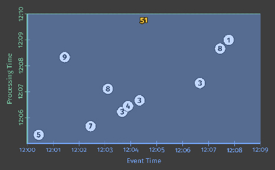经典批处理[清单1](https://www.oreilly.com/radar/the-world-beyond-batch-streaming-102/#L1) / [图2](https://www.oreilly.com/radar/the-world-beyond-batch-streaming-102/#FIG2) | 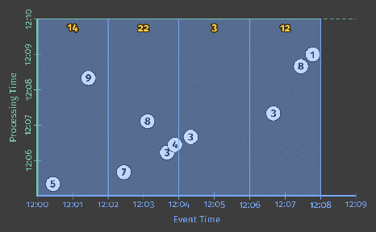修复了Windows批处理[清单2](https://www.oreilly.com/radar/the-world-beyond-batch-streaming-102/#L2) / [图4](https://www.oreilly.com/radar/the-world-beyond-batch-streaming-102/#FIG4) | 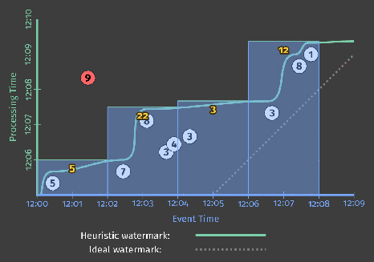修复了Windows流水印[清单2](https://www.oreilly.com/radar/the-world-beyond-batch-streaming-102/#L2) / [图6](https://www.oreilly.com/radar/the-world-beyond-batch-streaming-102/#FIG6) |
| ------------------------------------------------------------ | ------------------------------------------------------------ | ------------------------------------------------------------ |
| 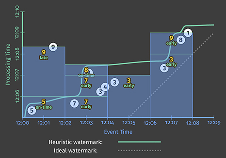早/晚预算[清单7](https://www.oreilly.com/radar/the-world-beyond-batch-streaming-102/#L7) / [图9](https://www.oreilly.com/radar/the-world-beyond-batch-streaming-102/#FIG9) | 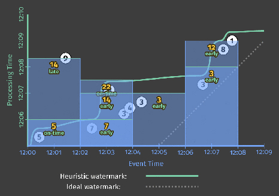早/晚累积编目[4](https://www.oreilly.com/radar/the-world-beyond-batch-streaming-102/#L4)＆[5](https://www.oreilly.com/radar/the-world-beyond-batch-streaming-102/#L5) / [图7](https://www.oreilly.com/radar/the-world-beyond-batch-streaming-102/#FIG7) | 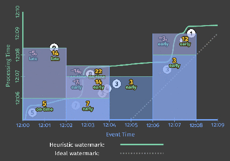早/晚缩回[清单8](https://www.oreilly.com/radar/the-world-beyond-batch-streaming-102/#L8) / [图10](https://www.oreilly.com/radar/the-world-beyond-batch-streaming-102/#FIG10) |
| 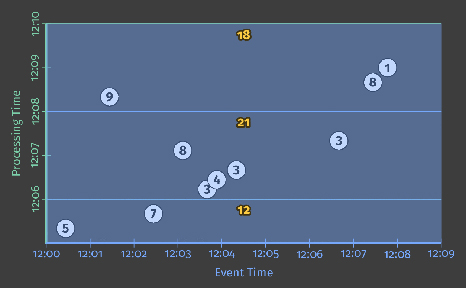[清单9](https://www.oreilly.com/radar/the-world-beyond-batch-streaming-102/#L9) / [图14的](https://www.oreilly.com/radar/the-world-beyond-batch-streaming-102/#FIG14)处理时间（出价） | 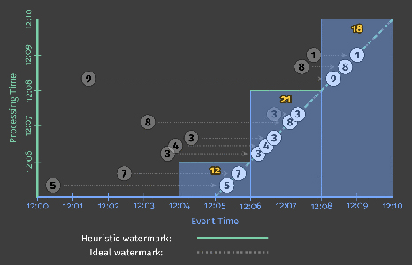加工时间（入水时间）[清单10](https://www.oreilly.com/radar/the-world-beyond-batch-streaming-102/#L10) / [图15](https://www.oreilly.com/radar/the-world-beyond-batch-streaming-102/#FIG15) | 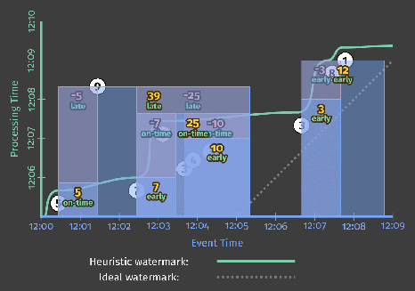会议[清单11](https://www.oreilly.com/radar/the-world-beyond-batch-streaming-102/#L11) / [图17](https://www.oreilly.com/radar/the-world-beyond-batch-streaming-102/#FIG17) |

图18. **一个输入集上的九种输出变化。**图片提供：Tyler Akidau。

感谢您的耐心配合和关注。下次见！

## **8 后记**

### **额外资源**

如果您想了解有关数据流的更多信息，我们碰巧有[一大堆优秀的文档](https://cloud.google.com/dataflow/docs/)在等您。替代，我们还有一个非常不错的[代码演练](https://cloud.google.com/dataflow/examples/gaming-example)，它覆盖了四个示例管道，用于分析移动游戏场景中的数据，并在[GitHub上](https://github.com/GoogleCloudPlatform/DataflowJavaSDK-examples/tree/master/src/main/java8/com/google/cloud/dataflow/examples/complete/game)提供了完整代码；如果您有兴趣查看实际的数据流代码，那就是您的门票。

如果您更喜欢视频观看类型，Frances Perry在@Scale 2015大会上就数据流模型进行了[精彩的演讲](https://www.youtube.com/watch?v=3UfZN59Nsk8)，对她说我们称为“ [退缩](https://www.youtube.com/watch?v=3UfZN59Nsk8&feature=youtu.be&t=1710) ”的部分进行了模数化；那部分是<生气的舌头象征笑脸/>。

而且，如果由于某种原因导致您想听我讲学术的话，我写了[一篇](http://www.vldb.org/pvldb/vol8/p1792-Akidau.pdf)有关VLDB优秀人才层次在去年发表的论文。尽管这些博客文章可以说是更全面的（没有人为的页面限制！），而且更漂亮（颜色！动画！），但从该论文的Google经验中激发用例的一些有趣的细节，在其他任何地方都找不到。。，另外，它非常清楚，简洁地激发了对某种语义的需求，同时也为探索一些相关的学术文献提供了一个很好的起点。

### **与现实的背离**

为了完整起见，在这篇文章中提供的示例中，我想指出一些与现实的偏差（这是指发布时的当前Google Cloud Dataflow实现）：

在清单[4](https://www.oreilly.com/radar/the-world-beyond-batch-streaming-102/#L4)，[5](https://www.oreilly.com/radar/the-world-beyond-batch-streaming-102/#L5)，和[6](https://www.oreilly.com/radar/the-world-beyond-batch-streaming-102/#L6)，无蓄积模式中指定，但累积的模式是什么，我们得到在执行实际上，目前在数据流中没有默认的累积模式：。您必须指定丢弃或累积模式释放该功能后，我们将保留默认的累积和缩回模式。

尚不支持撤消。我们正在努力。

默认的允许延迟时间实际为0。 。

在默认情况下，实际上是一个重复的水印替换，以默认的允许延迟时间0为边界。在[清单3中](https://www.oreilly.com/radar/the-world-beyond-batch-streaming-102/#L3)，为了简单起见，我替换（等效地）它是替代水印替换。

## **9 致谢**

最后但并非最不重要的一点：很多人都很棒，在这里我想感谢其中的一部分人，以帮助他们创建这些庞然大物的博客文章。

这些帖子中的内容提炼了Google，整个行业和整个学术界无数极度聪明的人的工作。我要对他们全部表示诚挚的谢意，并且感到遗憾的是，即使我尝试了，也无法将他们全部列出。

在Google内部，对数据流，Flume，MapReduce，MillWheel和相关团队的贡献值得称赞，这些年来，他们一直致力于将这些想法付诸实践。除了我在设计高级流模型中最初的犯罪合作伙伴，Robert Bradshaw和丹尼尔·米尔斯以及本·钱伯斯的忍者工程技能和洞察力，以实现该模型的棘手和更微妙的部分外，我还希望特别要感谢Paul Nordstrom和昔日的MillWheel扩展的低级基元元，我们随后可以在此基础上合并此处中描述的高级模型，现在体现在Dataflow SDK中。如果没有他们的视野和技能，我认为大规模流处理的世界将大为不同。

最后，我要感谢那些反复花费时间，思想和支持这些职位的人们的不懈努力，特别是：弗朗西斯·佩里，拉斐尔·J·费尔南德斯·莫克图祖玛，格热格斯·克萨科夫斯基和威廉·范本佩。当然，我在O'Reilly的无畏编辑Marie Beaugureau，主要是因为她的深刻见解使这些帖子成为了值得阅读的东西（手指交叉），而且还因为她对我不断地尝试颠覆既既定编辑标准的耐心等待。

------

[[1\]](https://www.oreilly.com/radar/the-world-beyond-batch-streaming-102/#_ftn1)请注意，O'Reilly编辑在技术上反对使用该原本扩展长的单词，但在我身上的要求下，已宽容地承认将其包括在内。[（返回）](https://www.oreilly.com/radar/the-world-beyond-batch-streaming-102/#F1)

[[2\]](https://www.oreilly.com/radar/the-world-beyond-batch-streaming-102/#_ftn2)在这里忍受。杀死在oreilly.com上通过复合标点符号（即表情符号）进行细粒度的情感表达。[（返回）](https://www.oreilly.com/radar/the-world-beyond-batch-streaming-102/#F2)

[[3\]](https://www.oreilly.com/radar/the-world-beyond-batch-streaming-102/#_ftn3)请注意，我特别选择从启发式水印中省略9的值，因为这将有助于我对后续数据和水印滞后提出一些重要观点；实际上，试探性水印可能会忽略其他一些值，如果您希望从水印中清除迟到的数据（在某些情况下非常有效，例如重复检测，而您只是希望尽快查看大部分数据），则不必启发式水印而不是完美水印；您真正想要的是一个百分位数水印，该水印可从计算中显式删除某些迟到数据。[（返回）](https://www.oreilly.com/radar/the-world-beyond-batch-streaming-102/#F3)

[[4\]](https://www.oreilly.com/radar/the-world-beyond-batch-streaming-102/#_ftn4)实话说，之前，我们实际上已经在所有示例中看到了这样的隐式贯通，甚至是批处理示例；在批处理中，水印从概念上讲在批处理结束时会变为无穷大，从而触发所有活动窗口，甚至是跨越所有事件时间的并行窗口。[（返回）](https://www.oreilly.com/radar/the-world-beyond-batch-streaming-102/#F4)

[[5\]](https://www.oreilly.com/radar/the-world-beyond-batch-streaming-102/#_ftn5)指定使用最先导致滞后数据的指标（即启发式水印）来指定处理滞后数据的范围似乎有些奇怪。从某种意义上说是这样。但是在可用的选项中，可以说是最好例如工人崩溃，导致管道停滞了几分钟），这可能导致窗口实际上没有机会处理原本应该拥有的最新数据。通过在事件时域中指定范围，[（返回）](https://www.oreilly.com/radar/the-world-beyond-batch-streaming-102/#F5)

[[6\]](https://www.oreilly.com/radar/the-world-beyond-batch-streaming-102/#_ftn6)可能有人指出，从逻辑上讲应该有第四种模式，即抛弃和替换；该模式在大多数情况下并不是很有用，因此在这里我将不作进一步讨论。[（返回）](https://www.oreilly.com/radar/the-world-beyond-batch-streaming-102/#F6)

 

